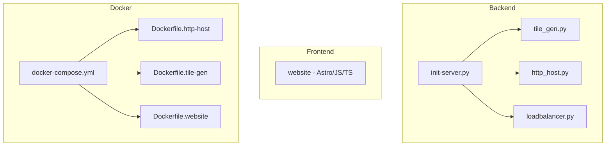

# OpenFreeMap Repository Review & Dockerization Assessment

---

## Executive Summary

This report provides a technical deep-dive into the OpenFreeMap repository, focusing on its architecture, deployment process, and Docker containerization. The project is a Python and JavaScript/TypeScript monorepo. Docker support has been added for all major components: HTTP Host, Tile Generator, and Website.

The Debug Proxy (Cloudflare Worker) module has been **removed** from this repository as part of the Docker migration effort.

---

## Key Repositories Table

| Repository                | Purpose                                  |
|--------------------------|------------------------------------------|
| JoeNapatC/openfreemap    | Main repo: backend, frontend, deployment |

---

## Architecture Overview

---

## Deployment Options

### 1. SSH Deployment (Original)

- Manual deployment via SSH using Fabric
- Clone repo, edit `.env`, and run `init-server.py` to configure a remote Ubuntu server
- System requirements: Ubuntu 22+, root access, large SSD
- Not intended for local/dev machines except via VM (e.g., OrbStack for macOS)

### 2. Docker Deployment (New)

- Use `docker-compose up` with the provided `docker-compose.yml`
- Configuration via environment variables in `.env` file
- HTTP Host and Tile Gen containers require `--privileged` mode for Btrfs operations
- Website container is a simple static file server
- See `docs/docker_deployment.md` for full instructions

---

## Component Sections

### 1. Python Backend Entrypoints

- **init-server.py**: Orchestrates server setup via SSH and Fabric.
- **tile_gen.py**: CLI for generating and uploading map tiles.
- **http_host.py**: Manages HTTP hosts, mounts images, syncs assets, and configures nginx.
- **loadbalancer.py**: Manages DNS load balancing.

### 2. Frontend (Astro/JS/TS)

- Astro-based static site in `website/`, built and served with `pnpm` and Node.js.
- Dockerized via multi-stage build in `docker/Dockerfile.website`.

### 3. Docker Containers

- **HTTP Host** (`docker/Dockerfile.http-host`): Ubuntu 22.04-based, includes nginx, Python, btrfs-progs, rclone. Requires `--privileged`.
- **Tile Generator** (`docker/Dockerfile.tile-gen`): Ubuntu 22.04-based, includes Java (Temurin 24), Python, btrfs-progs. Requires `--privileged`.
- **Website** (`docker/Dockerfile.website`): Node.js Alpine-based, multi-stage build with Astro.

---

## Dockerization Notes

### Privileged Containers
The HTTP Host and Tile Gen containers must run with `--privileged` because they:
- Mount Btrfs partition images as loop devices
- Modify `/etc/fstab`
- Require access to kernel Btrfs modules

### Volumes
- `ofm-data` → `/data/ofm` (tile data, config, assets)
- `nginx-data` → `/data/nginx` (nginx config, logs, certs)
- `mnt-ofm` → `/mnt/ofm` (Btrfs mount points)

### Environment Variables
Configuration is provided via environment variables that are converted to `config.json` at container startup. See `docker/.env.example` for all available options.

---

## Removed Components

### Debug Proxy (Cloudflare Worker) — REMOVED
The `modules/debug_proxy/` directory has been removed. It was a Cloudflare Worker that proxied `/styles` requests to `tiles.openfreemap.org`. This functionality is no longer needed as tile serving is handled directly by the HTTP Host container/server.
